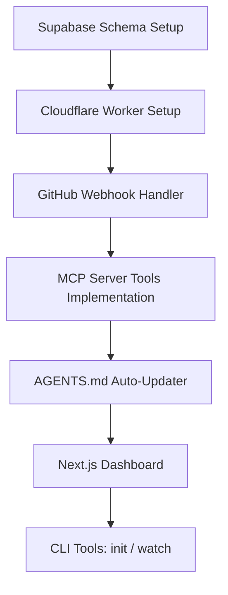

# PlanSync Implementation Plan

PlanSync is a lightweight, real-time coordination layer designed for multi-agent teams working on a shared GitHub repository. It syncs the project status, architecture decisions, API contracts, and active session heartbeats to a Supabase Postgres instance, making it available live via a remote MCP server and an interactive web dashboard.

---

## 1. Directory Structure

We will structure the project workspace (`C:\Users\piyus\OneDrive\Desktop\aproject 1`) as follows:

```
aproject 1/
├── supabase/
│   └── schema.sql              # Postgres schema definitions & pgvector extensions
├── plansync-mcp/               # Cloudflare Worker (MCP Server + Webhook Receiver)
│   ├── package.json
│   ├── tsconfig.json
│   ├── wrangler.json
│   └── src/
│       ├── index.ts            # Entry point for Worker, routes, and SSE/HTTP logic
│       ├── tools.ts            # MCP tools definitions and schemas
│       ├── webhook.ts          # GitHub Webhook handler (commit extraction, AST processing)
│       ├── db.ts               # Supabase database helpers
│       ├── ast.ts              # TypeScript/Python contract extractors
│       └── embeddings.ts       # Semantic similarity calculations
├── plansync-dashboard/         # Next.js Dashboard (shadcn/ui + Tailwind CSS)
│   ├── package.json
│   ├── app/
│   │   ├── page.tsx            # Live feed of commits, plan status, drift indicators
│   │   ├── layout.tsx
│   │   └── api/
│   │       └── auth/           # OAuth token generator for dashboard auth
│   └── components/
├── plansync-cli/               # Node CLI (npm package)
│   ├── package.json
│   ├── bin/
│   │   └── index.js            # Commander implementation (init, watch)
│   └── src/
│       ├── watcher.js          # File watcher to send session heartbeats
│       └── git.js              # Git info helpers
└── AGENTS.md                   # Auto-maintained documentation template
```

---

## 2. Core Modules & Build Order



### Phase 1: Database Setup
1. Define the PostgreSQL tables inside `supabase/schema.sql`.
2. Configure `pgvector` for contract similarity checks.
3. Configure Row-Level Security (RLS) or project bearer token checks.

### Phase 2: Cloudflare Worker (Webhook + MCP Server)
1. Initialize Wrangler TypeScript project.
2. Implement `/webhook` handler:
   - Authenticates payload signature from GitHub App.
   - Extracts commit messages, files modified, author.
   - Triggers AST parser to find new function signatures / API contracts.
   - Triggers semantic duplicate checks.
   - Updates `decisions`, `contracts`, `commit_events`, and `plan_nodes` tables.
3. Implement `/mcp` HTTP endpoint supporting Server-Sent Events (SSE) or Streamable HTTP.
   - Implement `tools/list` schema.
   - Implement handlers for: `plan_task`, `get_api_contract`, `check_collision`, `get_recent_decisions`, `check_semantic_duplicate`, `catch_me_up`.

### Phase 3: Contract Extraction Parser
- Parse JS/TS files using a lightweight typescript compiler parse tree.
- Parse Python files using regex or a simplified parser.
- Store results in `contracts` table.

### Phase 4: AGENTS.md Maintenance
- Build utility to read/update `AGENTS.md` boundaries:
  - `<!-- AUTO:DECISIONS -->`
  - `<!-- AUTO:OWNERSHIP -->`
  - `<!-- AUTO:CONTRACTS -->`

### Phase 5: Dashboard
- Build Next.js app visualizing:
  - Commit history log.
  - Active developer/agent sessions with current edited files.
  - Extracted architecture decisions.
  - API contracts map.

### Phase 6: CLI
- Build Node.js CLI utility `plansync-cli`.
- `init`: creates `AGENTS.md`, redirects user to link Supabase/GitHub App.
- `watch`: runs in background, checks modified files locally, hits Worker `/session/heartbeat` endpoint.

---

## 3. Tool Details & Zod Schemas

| Tool | Inputs | Description |
|---|---|---|
| `plan_task` | `description` (string), `target_files` (array) | Checks for similar active tasks or collisions, updates task status. |
| `get_api_contract` | `module_name` (string) | Retrieves formal signatures of module functions. |
| `check_collision` | `file_paths` (array) | Scans database for overlap in active sessions or recent commits. |
| `get_recent_decisions`| `topic` (optional string) | Returns recent architecture summaries. |
| `check_semantic_duplicate`| `function_name` (string), `signature_or_docstring` (string) | Searches using pgvector for duplicate utilities. |
| `catch_me_up` | `since_minutes` (optional number) | Summarizes changes in project state. |
