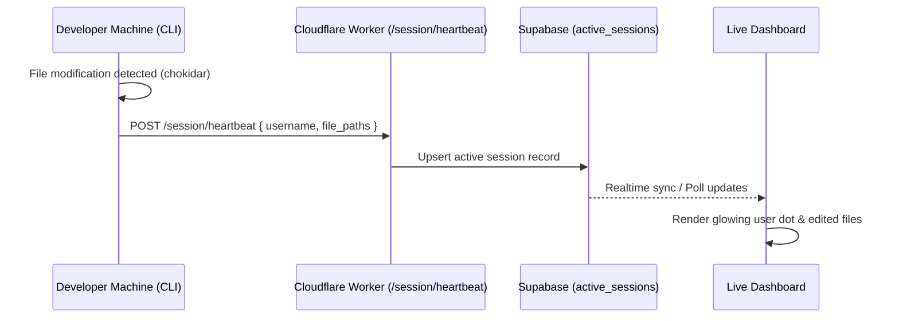
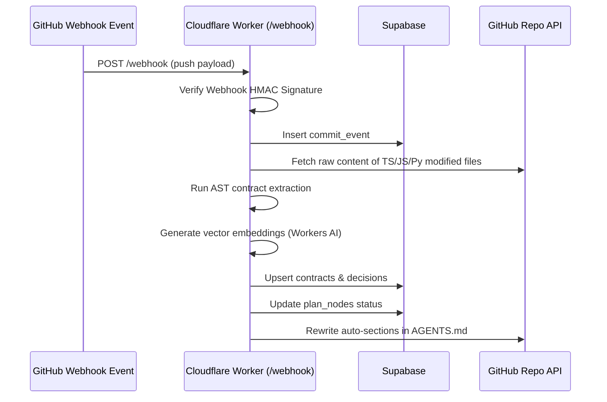

# PlanSync Architecture & Deployment Guide

This document details the fully-implemented files, database structures, and runtime designs for **PlanSync** — the multi-agent coordination layer.

---

## 1. Directory Map & Code References

The project consists of three lightweight parts with clean separations:

- **Database**: [schema.sql](file:///C:/Users/piyus/OneDrive/Desktop/aproject%201/supabase/schema.sql)
- **Cloudflare Worker (MCP + Webhook)**:
  - [index.ts](file:///C:/Users/piyus/OneDrive/Desktop/aproject%201/plansync-mcp/src/index.ts) — Router, Auth, SSE & Stateless transport
  - [tools.ts](file:///C:/Users/piyus/OneDrive/Desktop/aproject%201/plansync-mcp/src/tools.ts) — The 6 coordination tools
  - [webhook.ts](file:///C:/Users/piyus/OneDrive/Desktop/aproject%201/plansync-mcp/src/webhook.ts) — GitHub push verify, AST trigger, decisions, and `AGENTS.md` rewriting
  - [db.ts](file:///C:/Users/piyus/OneDrive/Desktop/aproject%201/plansync-mcp/src/db.ts) — PostgREST fetch client
  - [ast.ts](file:///C:/Users/piyus/OneDrive/Desktop/aproject%201/plansync-mcp/src/ast.ts) — Multi-language signature parser
  - [embeddings.ts](file:///C:/Users/piyus/OneDrive/Desktop/aproject%201/plansync-mcp/src/embeddings.ts) — Workers AI embeddings
- **Next.js Dashboard**:
  - [page.tsx](file:///C:/Users/piyus/OneDrive/Desktop/aproject%201/plansync-dashboard/app/page.tsx) — Interactive dark-mode dashboard
  - [db.ts](file:///C:/Users/piyus/OneDrive/Desktop/aproject%201/plansync-dashboard/lib/db.ts) — Fallback mock database client
- **CLI Watcher**:
  - [index.js](file:///C:/Users/piyus/OneDrive/Desktop/aproject%201/plansync-cli/bin/index.js) — commander commands (`init`, `watch`)
  - [watcher.js](file:///C:/Users/piyus/OneDrive/Desktop/aproject%201/plansync-cli/src/watcher.js) — chokidar file watcher
  - [git.js](file:///C:/Users/piyus/OneDrive/Desktop/aproject%201/plansync-cli/src/git.js) — local repository meta

---

## 2. Core Flows

### 2.1 Developer Session Watcher (CLI)


### 2.2 GitHub Push Webhook Processing


---

## 3. Deployment Instructions

### 3.1 Setup Database (Supabase)
1. Create a new Supabase Project.
2. In the **SQL Editor**, paste and execute [schema.sql](file:///C:/Users/piyus/OneDrive/Desktop/aproject%201/supabase/schema.sql) to initialize the tables, indexes, and pgvector cosine search function.

### 3.2 Deploy Cloudflare Worker (`plansync-mcp`)
1. Open [wrangler.json](file:///C:/Users/piyus/OneDrive/Desktop/aproject%201/plansync-mcp/wrangler.json) and replace the mock values with your Supabase credentials:
   - `SUPABASE_URL`
   - `SUPABASE_ANON_KEY`
   - `GITHUB_WEBHOOK_SECRET` (A strong random secret for Webhook verification)
2. Deploy the worker to your Cloudflare account:
   ```bash
   cd plansync-mcp
   wrangler deploy
   ```
3. Your remote MCP server is now live at `https://plansync-mcp.<your-subdomain>.workers.dev/mcp`.
4. In your GitHub App configuration, set the **Webhook URL** to:
   `https://plansync-mcp.<your-subdomain>.workers.dev/webhook`

### 3.3 Run the Web Dashboard
1. Set up your environment variables (or let it run in demo preview mode automatically if empty):
   Create a `.env.local` inside `plansync-dashboard/`:
   ```env
   NEXT_PUBLIC_SUPABASE_URL=https://your-project-id.supabase.co
   NEXT_PUBLIC_SUPABASE_ANON_KEY=your-supabase-anon-key
   ```
2. Start the Next.js dev server:
   ```bash
   cd plansync-dashboard
   npm run dev
   ```
3. Open your browser to `http://localhost:3000`.

### 3.4 Initialize and Run the CLI
1. Initialize PlanSync for the local repository:
   ```bash
   cd plansync-cli
   npm link  # Optional, to expose 'plansync' binary globally
   node bin/index.js init --token <SUPABASE_PROJECT_UUID> --server https://plansync-mcp.<your-subdomain>.workers.dev
   ```
2. Start watching for active coding heartbeats:
   ```bash
   node bin/index.js watch
   ```
